# AHUT 安徽工业大学晚寝自动签到 (AHUT Auto Check-In)

[](https://www.python.org/)
[](LICENSE)
[]()

专为**安徽工业大学（AHUT）微信移动端考勤系统**打造的无人值守自动打卡解决方案。

项目提供两套独立且完备的自动化实现方案，用户可按需选用：
- 🌟 **云端 GitHub Actions 方案（首选推荐）**：全托管、零成本、无需开机，利用 GitHub 免费算力每晚自动定时无头签到并推送结果；
- 🖥️ **本地桌面浏览器方案（备选方案）**：基于 Edge / Chrome + Tampermonkey 油猴脚本，在真实浏览器图形环境下适配会话并完成打卡。

---

## 🌟 核心特性

- 🌟 **云端全自动首选（GitHub Actions）**：
  - **永久零成本全托管**：利用 GitHub Actions 公开仓库无限制（或私有仓库每月 2000 min）的免费托管 Runner，无需云服务器；
  - **定时自动调度**：每晚 21:31 准时调度无头签到，支持多学号并发，直接提交协议并推送通知；
- 🖥️ **本地图形化备选（桌面浏览器 + 油猴脚本）**：
  - **真实环境会话适配**：自动提取 PC 端登录凭证并注入移动端 H5 存储规范，支持开箱即用自动填充账密；
  - **防竞态与状态锁死**：悬浮 HUD 看板实时展示打卡状态；若检测到今日已完成打卡，看板显示 `🎉 今日已签到` 并安全退出，杜绝重复提交；
  - **唤醒调度支持**：提供配套 Windows 任务计划程序安装工具，支持从睡眠状态自动唤醒计算机执行；
- 🔄 **动态 TaskID 自愈提取**：自动请求任务分页接口提取当期最新有效考勤任务，跨学期、新任务更迭无需人工介入修改任务编号；
- 🔔 **多通道智能分级告警**：
  - **日常结果**：通过 [Server 酱·Turbo 版](https://sct.ftqq.com/) 推送每日详细微信打卡报表；
  - **失败强提醒**：集成 [ntfy.sh](https://ntfy.sh) 官方 JSON 规范，**仅在打卡失败或异常时触发最高优先级（Priority 5）夜间免打扰穿透响铃**，提醒用户及时处置。

---

## 🏗️ 方案架构图

```mermaid
flowchart TD
    subgraph PlanA["方案一（首选推荐）：云端 GitHub Actions 全托管"]
        TimerActions["GitHub 定时调度 (每晚 21:31 CST)"] --> Runner["Ubuntu Runner (main.py)"]
        Runner --> DynamicTaskA["动态提取今日 TaskID 与基准定位"]
        DynamicTaskA --> JitterA["GPS 拟真抖动收敛 (±0.0002°)"]
        JitterA --> ApiSign["协议层提交打卡"]
        ApiSign --> ServerChan["Server 酱推送日常微信结果"]
        ApiSign -.->|仅签到异常/失败| Ntfy["ntfy Priority 5 免打扰穿透响铃"]
    end

    subgraph PlanB["方案二（备选方案）：本地桌面浏览器 + 油猴脚本"]
        LocalTrigger["本地定时调度 / 手动一键启动"] --> LocalBrowser["拉起 Edge / Chrome 独立浏览器"]
        LocalBrowser --> Tampermonkey["油猴脚本 (wise-auto-adapter.user.js)"]
        Tampermonkey --> CheckToday{"核验今日打卡状态"}
        CheckToday -->|今日已签到| Skip["看板显示「🎉 今日已签到」\n安全终止 (0 业务写入)"]
        CheckToday -->|未签到| LocalSign["注入会话并执行打卡"]
        LocalSign --> LocalDone["本地打卡完成"]
    end
```



---

## 📂 项目结构

```text
ahut-auto-checkin/
├── .github/
│   └── workflows/
│       └── daily-sign.yml             # GitHub Actions 定时签到工作流 (21:31 CST)
├── main.py                            # 云端自动化签到主程序
├── notifier.py                        # Server 酱微信报表与 ntfy 强穿透告警
├── requirements.txt                   # Python 核心依赖 (aiohttp)
├── local/                             # 本地桌面浏览器 + 油猴脚本套件
│   ├── wise-auto-adapter.user.js      # 油猴脚本 (v1.2.0 内嵌账密/动态TaskID/HUD看板)
│   ├── Start-WiseCheckIn.cmd / .ps1   # 本地一键签到启动器
│   ├── Check-WiseCheckIn.cmd          # 本地只读状态检查工具 (0写入)
│   ├── Set-EdgeConfig.cmd / .ps1      # Edge 浏览器路径与 User Data 自动探测器
│   ├── Install-WiseTask.cmd / .ps1    # Windows 任务计划程序一键安装器
│   ├── Uninstall-WiseTask.cmd / .ps1  # 任务计划程序一键卸载器
│   ├── wise-adapter-console.js        # 控制台免扩展运行脚本
│   └── wise-checkin.config.template.json # 本地脱敏配置模板
├── docs/
│   ├── actions-setup.md               # GitHub Actions 云端部署与 Secrets 详细配置
│   └── local-setup.md                 # 本地油猴与任务计划程序部署详细指引
├── README.md                          # 项目说明文档
├── LICENSE                            # MIT 开源许可证
└── .gitignore
```

---

## 🚀 快速上手

### 方案一：云端 GitHub Actions 部署（首选推荐）

只需 3 分钟即可完成全托管部署：

1. **Fork 本仓库** 或新建公开仓库推入本源码；
2. 进入仓库的 **Settings** ➔ **Secrets and variables** ➔ **Actions**；
3. 点击 **New repository secret** 添加凭据：
   - `STUDENT_IDS`：您的统一身份认证学号（必填，多人用英文分号 `;` 分隔）；
   - `PASSWORDS`：您的密码（选填，默认 `Ahgydx@920`）；
   - `SERVERCHAN_SENDKEY`：[Server酱](https://sct.ftqq.com/) SendKey（选填，用于微信通知）；
   - `NTFY_TOPIC`：[ntfy.sh](https://ntfy.sh) 自定频道（选填，仅在失败时高优先级告警）；
4. 进入 **Actions** 页面，点击 `Daily Check-In` ➔ **Run workflow** 即可手动联调验证。
> 详细图文指引请参考 [docs/actions-setup.md](docs/actions-setup.md)。

---

### 方案二：本地桌面与油猴部署（备选方案）

适用于希望在本地桌面真实浏览器图形界面中执行打卡的场景：

1. 打开 Edge 或 Chrome 浏览器，安装 [Tampermonkey (油猴)](https://www.tampermonkey.net/)；
2. 复制 [`local/wise-auto-adapter.user.js`](local/wise-auto-adapter.user.js) 源码导入油猴；
3. 在 `local/` 目录下双击运行 `Set-EdgeConfig.cmd` 自动完成浏览器环境配置；
4. （可选定时调度）右键管理员运行 `Install-WiseTask.cmd`，自动注册 Windows 任务计划程序（预设触发时间为 21:35:00，可自定义修改，详见本地指南）。
> 详细配置与故障排查请参考 [docs/local-setup.md](docs/local-setup.md)。

---

## 📝 致谢与开源参考

本项目云端签到脚本来源于：
- [dawn200712/AHUT](https://github.com/dawn200712/AHUT)
- [UnthinkingBrain/-_ahut_wqqd](https://github.com/UnthinkingBrain/-_ahut_wqqd)

在此基础上，本项目：
1. 取消对已取消免费额度的阿里云 FC 的依赖，完全迁移并适配 GitHub Actions 免费算力体系；
2. 修复原上游坐标粗粒度偏移容易导致超出考勤围栏的缺陷，优化为 $\pm 0.0002^\circ$ 拟真抖动算法；
3. 引入 ntfy 官方 JSON 强穿透双通道告警体系，删除了邮件提醒接口；
4. 提供本地桌面油猴自动化独立方案，满足不同使用习惯与环境下的打卡需求。

---

## ⚖️ 免责声明 (Disclaimer)

1. 本项目仅供个人学习、网络协议分析与容灾自动化技术研究交流使用；
2. 用户使用本项目产生的所有行为及后果均由使用者自行承担，开发者不对因使用本工具导致的任何形式的纪律处分、数据异常或其他损失承担任何法律责任；
3. 请合理安排作息，严格遵守学校晚归考勤管理规定。
